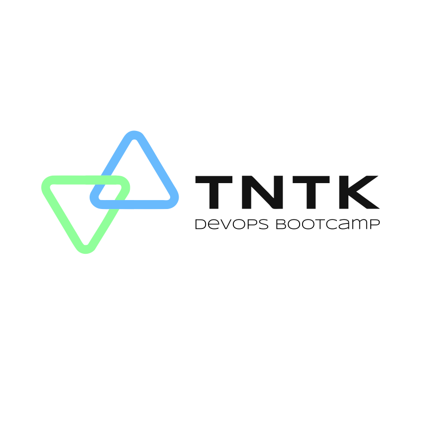

<a id="readme-top"></a>


<!-- PROJECT LOGO -->
<br />
<div align="center">
  <a href="https://github.com/github_username/repo_name">
    
  </a>

<h3 align="center">TNTK Infra 2.0</h3>
</div>


<!-- TABLE OF CONTENTS -->
<details>
  <summary>Table of Contents</summary>
  <ol>
    <li>
      <a href="#about-the-project">About The Project</a>
      <ul>
        <li><a href="#built-with">Built With</a></li>
      </ul>
    </li>
    <li>
      <a href="#getting-started">Getting Started</a>
      <ul>
        <li><a href="#prerequisites">Prerequisites</a></li>
        <li><a href="#installation">Installation</a></li>
      </ul>
    </li>
    <li><a href="#usage">Usage</a></li>
  </ol>
</details>


<!-- ABOUT THE PROJECT -->
## About The Project
This repo contains the Terraform code for building the tntk-io 2.0 final project


### Built With

*  Terraform
<p align="right">(<a href="#readme-top">back to top</a>)</p>


<!-- GETTING STARTED -->
## Getting Started

To get started with this project, you'll need to create a tfvars override file. You can use the provided generate-overrides.sh script to create one:

1. Run the generate-overrides script:
   ```sh
   ./generate-overrides.sh
   ```

2. The script will prompt you for required values and create a terraform.tfvars file with your inputs

3. Review the generated terraform.tfvars file and adjust any values as needed

This will create a tfvars file with the necessary variables pre-populated based on your inputs.


### Prerequisites

Run the following commands to install prereqs for this final project.
* ```sh
    brew install tfenv gh
  ```

### Installation

1. Clone the repo
   ```sh
   git clone https://github.com/tntk-io/tntk-infra-2.0.git
   ```
2. Run the generate-overrides script:
   ```sh
   ./generate-overrides.sh
   ```
   
4. Run Terraform commands to build project
   ```sh
   terraform init
   terraform plan -out my.plan
   terraform apply
   ```

<p align="right">(<a href="#readme-top">back to top</a>)</p>


<!-- USAGE EXAMPLES -->
## Usage

Here is a sample tfvars override file you can use as a template.
```
# Standard variables
aws_region = "us-east-2"
aws_account_id = "98239829393"
base_domain = "dev.ernestdevops.net"
tag_env = "dev"
datadog_api_key = "test"
datadog_application_key = "test"
datadog_region = "tes.test.com"
github_email = "test@test.com"
github_name = "test"
github_organization = "ernram"
github_token = "test"

# This variable is used to imports GitHub Repos into your ArgoCD instance, so we can deploy Helm charts from that repo
argocd_repos = {
  test = {
    repo_url = "https://github.com/ernram/final-cd"
    name     = "final-cd"
  }
}
# This variable is used to define ArgoCD applications that will be automatically created in ArgoCD when it comes up
argocd_apps = {
  shared-resources = {
    name      = "shared-resources"
    namespace = "argocd"
    labels = {
      shared = "true"
    }
    destination = {
      server    = "https://kubernetes.default.svc"
      namespace = "default"
    }
    source = {
      repo_url        = "https://github.com/tntk-io/tntk-k8s-manifests"
      chart           = "charts/dev-resources"
      target_revision = "0.0.1"
    }
    helm = {
      release_name     = "shared-resources"
      value_files_path = ["values.yaml"]
    }
  }
  tntk-web-2.0-dev = {
    name      = "tntk-api-dev"
    namespace = "argocd"
    labels = {
      environment = "dev"
    }
    destination = {
      server    = "https://kubernetes.default.svc"
      namespace = "dev"
    }
    source = {
      repo_url        = "https://github.com/tntk-io/tntk-web-2.0"
      chart           = "charts/tntk-web"
      target_revision = "0.0.1"
    }
    helm = {
      release_name     = "tntk-api"
      value_files_path = ["../../environments/values-dev.yaml"]
    }
  }
  tntk-orders-dev = {
    name      = "tntk-web-dev"
    namespace = "argocd"
    labels = {
      environment = "dev"
    }
    destination = {
      server    = "https://kubernetes.default.svc"
      namespace = "dev"
    }
    source = {
      repo_url        = "https://github.com/tntk-io/tntk-orders"
      chart           = "charts/tntk-orders"
      target_revision = "0.0.1"
    }
    helm = {
      release_name     = "tntk-web"
      value_files_path = ["../../environments/values-dev.yaml"]
    }
  }
  tntk-auth-dev = {
    name      = "tntk-auth-dev"
    namespace = "argocd"
    labels = {
      environment = "dev"
    }
    destination = {
      server    = "https://kubernetes.default.svc"
      namespace = "dev"
    }
    source = {
      repo_url        = "https://github.com/tntk-io/tntk-auth"
      chart           = "charts/tntk-auth"
      target_revision = "0.0.1"
    }
    helm = {
      release_name     = "tntk-api"
      value_files_path = ["../../environments/values-dev.yaml"]
    }
  }
  tntk-products-dev = {
    name      = "tntk-products-dev"
    namespace = "argocd"
    labels = {
      environment = "dev"
    }
    destination = {
      server    = "https://kubernetes.default.svc"
      namespace = "dev"
    }
    source = {
      repo_url        = "https://github.com/tntk-io/tntk-products"
      chart           = "charts/tntk-products"
      target_revision = "0.0.1"
    }
    helm = {
      release_name     = "tntk-products"
      value_files_path = ["../../environments/values-dev.yaml"]
    }
  }
}
# This variable is used to provide EKS permissions to additional IAM users or roles
aws_auth_config = {
  roles = [
    # {
    #   rolearn  = "arn:aws:iam::66666666666:role/role1"
    #   username = "role1"
    #   groups   = ["system:masters"]
    # }
  ],
  users = [
    {
      userarn  = "arn:aws:iam::038891198925:user/ernest.ramirez"
      username = "ernest.ramirez"
      groups   = ["system:masters"]
    }
  ],
  accounts = [
    "038891198925"
  ]
}
# This variable is used to define the ECR repos we should create
ecr_repos = {
  tntk-web = {
    name         = "tntk-web"
    count_number = 10
  }
  tntk-orders = {
    name         = "tntk-orders"
    count_number = 10
  }
  tntk-auth = {
    name         = "tntk-auth"
    count_number = 10
  }
  tntk-products = {
    name         = "tntk-products"
    count_number = 10
  }
}
# This variable is used to define EKS settings that will be applied to the cluster
eks_settings = {
  cluster = {
    name                                     = "final-project"
    version                                  = "1.29"
    cluster_endpoint_public_access           = true
    enable_cluster_creator_admin_permissions = true
  }
  cluster_addons = {
    eks-pod-identity-agent = {
      most_recent = true
    }
    coredns = {
      most_recent = true
    }
    kube-proxy = {
      most_recent = true
    }
    vpc-cni = {
      most_recent = true
    }
  }
  node_group_defaults = {
    instance_types = ["t3a.small"]
  }
  managed_node_groups = {
    tntk_eks_nodes = {
      min_size       = 2
      max_size       = 2
      desired_size   = 2
      instance_types = ["t3a.medium"]
      capacity_type  = "SPOT"
    }
  }
}
# This variable is used to define AWS tags that will be added onto relevant resources
tags = {
  Environment = "dev"
}
```

<!-- MARKDOWN LINKS & IMAGES -->
<!-- https://www.markdownguide.org/basic-syntax/#reference-style-links -->
[terraform-image]: https://static-00.iconduck.com/assets.00/terraform-icon-452x512-ildgg5fd.png
[terraform-url]: https://terraform.io
